# 从 V1 到 V2：Codex Sub-Agent，以及 CCSM 如何让第三方模型成为 V2 Child

> 一份从概念、官方实现到跨 Provider 适配的技术拆解报告  
> CCSwitchMulti / CCSM，2026-08-13

## 摘要

Sub-Agent 不是“再开一个聊天窗口”，也不是把同一份提示词重复发送给多个模型。它是 Codex 将一个目标拆成若干有边界的协作任务，让独立 child thread 完成探索、审查或实现，再由 parent thread 负责整合和最终交付的机制。

V1 已经具备启动、追问、等待和关闭 child 的能力；V2 的关键变化则是把协作对象从“一个 agent id”提升为“拥有规范任务路径、角色身份、mailbox 和可继续生命周期的任务”。因此 V2 解决的主要问题是**协作建模**，而不是简单多加几个模型参数。

但原生 V2 接入第三方模型时，会同时撞上四个边界：server-reserved 工具 schema、加密的协作参数、Codex 私有 `agent_message` input item，以及跨 Responses/Chat/Anthropic transport 的历史回放差异。CCSM 没有解密 OpenAI ciphertext，也没有重写 Codex orchestrator；它补齐的是两类能力：

1. **控制面**：把用户对角色能力的描述编译成 Codex 可发现的 role、catalog 和 config；
2. **数据面**：在不破坏 Official OAuth 的前提下，为 mixed-router 生成可投递明文，并只在真实第三方 child 已知后投影私有消息、物化 Provider 和转换 transport。

最终链路是：**用户表达角色意图 → CCSM 编译能力 → Codex parent 语义选角 → V2 创建 child → MultiRouter 物化真实 Provider → CCSM 做最小协议投影 → child 执行 → Codex 回收结果 → parent 整合**。

---

## 0. 如何阅读这份报告

### 0.1 三类事实必须分开

| 标记 | 代表什么 | 可以证明什么 |
|---|---|---|
| **OpenAI 文档 / Codex 源码** | 产品公开语义与当前官方实现 | 字段含义、调用顺序、配置优先级 |
| **openai/codex issue** | 特定版本、配置和现场中的公开复现 | “这个故障发生过”，不能外推成永久设计承诺 |
| **CCSM 源码 / 测试 / Release** | 本项目已实现的兼容行为 | 代码边界、回归契约和指定环境验证结果 |

完整事实账本见 [`docs/references/codex-v2-subagent-evidence-index.md`](references/codex-v2-subagent-evidence-index.md)。本文不会用 issue 猜测代替官方源码，也不会把 GitHub 的 macOS 构建成功说成某一台用户 Mac 已完成运行验收。

### 0.2 先给出全局地图

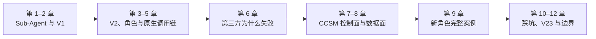

如果只想理解结论，可以读第 1、3、6、8、12 章；如果要审计实现，应连续阅读全部章节和引用。

---

## 1. Sub-Agent 在 Codex 中到底是什么

### 1.1 它首先是一种上下文治理机制

一个 Agent 同时承担仓库探索、日志阅读、代码修改、测试输出、风险审查和最终答复时，主线程会逐渐充满中间材料。真正用于决策的信息反而被淹没。这就是 OpenAI Subagents 文档所说的 context pollution / context rot 风险。

Sub-Agent 把“过程噪声”放进独立 child thread。parent 不需要携带每一次搜索输出，只需接收被压缩过的结论、证据和产物。其价值不是凭空增加智能，而是改变信息组织：

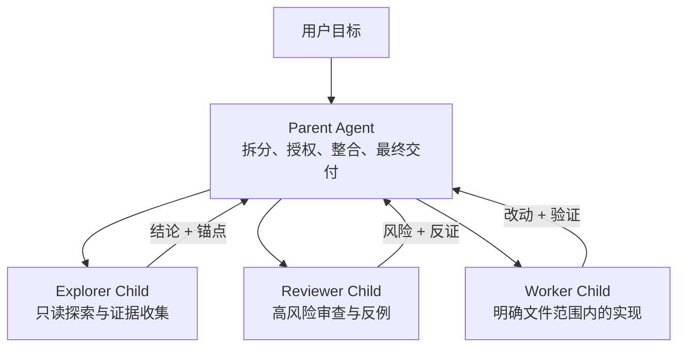

**图 1 — parent 保留目标与整合责任，child 承担有边界的过程。** 这也是为什么“最终合并、发布和对用户承诺”不应默认交给 child。

### 1.2 Parent 与 Child 的责任不是对称的

| 角色 | 应该拥有 | 不应默认拥有 |
|---|---|---|
| Parent | 用户目标、任务拆分、写入边界、冲突协调、结果整合、最终验收 | 每个探索细节和全部中间日志 |
| Child | 一项清晰任务、必要上下文、角色规则、工具和局部产物 | 未授权的范围扩张、最终发布与全局承诺 |

Sub-Agent 因而也不是“越多越好”。多个 child 同时修改同一组文件，会把上下文竞争换成写入竞争；短小、强依赖的任务也可能因为调度成本而更慢。官方文档同样提醒要谨慎处理 write-heavy parallel work。

### 1.3 一个具象例子

任务是“定位一个跨平台配置回归并解释引入版本”。串行单 Agent 往往依次读 Windows、macOS、Linux 代码，再查 Git 历史和测试；主线程会累积三个平台的大量输出。合理的 Sub-Agent 结构是：

- child A：只读审计 Windows 注册与启动链；
- child B：只读审计 macOS LaunchAgent；
- child C：只读审计 Linux autostart desktop entry；
- parent：比较三条证据、追溯共同提交、判断是共因还是平台特异问题。

这里的收益来自“互相独立的证据面”，不是单纯并行调用三个模型。

---

## 2. V1 Sub-Agent：以 Agent ID 为中心的生命周期

### 2.1 V1 的核心抽象

V1 工具族围绕一个运行中的 agent id 工作。官方 Codex 源码中的 V1 handler 将工具调用翻译成 `AgentControl` 操作，并让 child 从当前 turn 的有效配置继承 provider、审批、sandbox 和 cwd，再叠加可选 role 配置。

典型工具语义是：

| 工具 | 作用 |
|---|---|
| `spawn_agent` | 创建 child，获得 agent id |
| `send_input` | 给现有 child 继续发输入 |
| `resume_agent` | 恢复已暂停的 child |
| `wait_agent` | 等待一个或多个 child 状态变化 |
| `close_agent` | 关闭 child 生命周期 |

精确名称和 schema 会随 Codex 版本演进；这里描述的是已审计版本中的 V1 运行模型，不把它称作永远稳定的公共 API。

### 2.2 V1 结构图

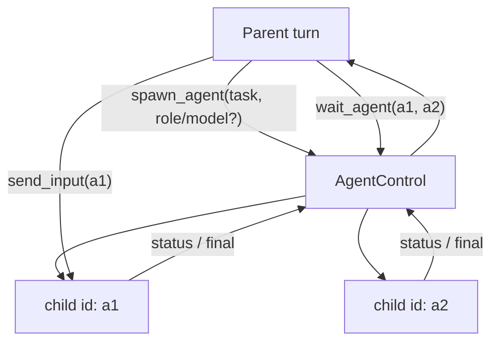

**图 2 — V1 的主要句柄是 agent id。** Parent 需要自己维护“a1 做什么、a2 做什么、下一步该追问谁”。

### 2.3 V1 生命周期状态机

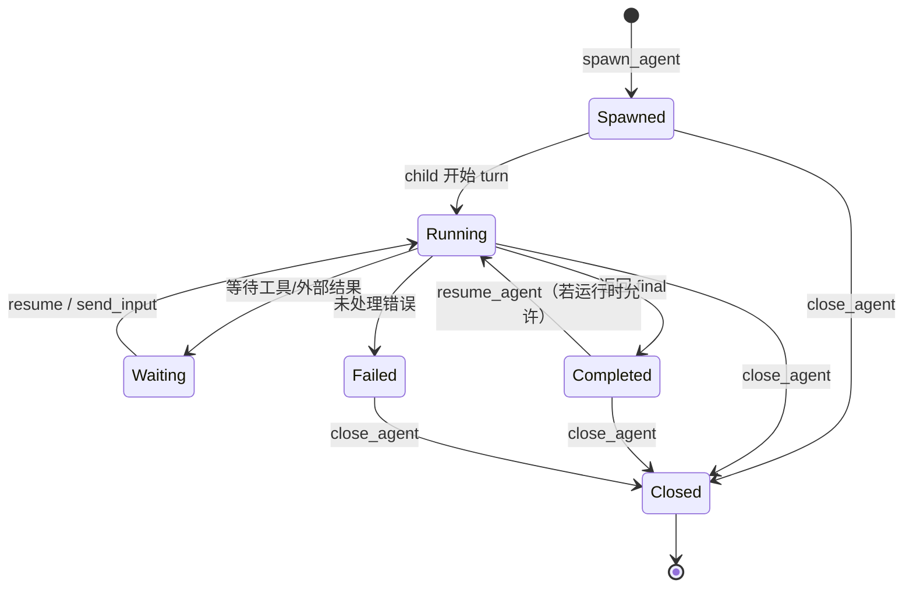

### 2.4 一次 V1 调用时序

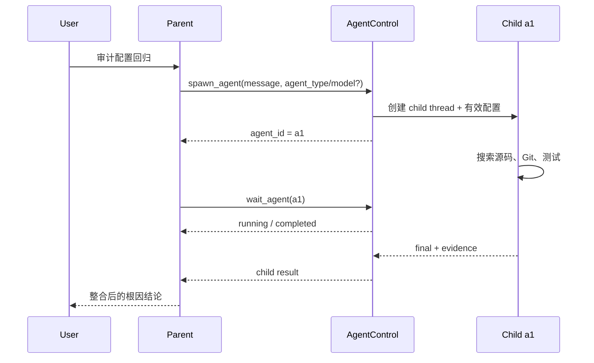

### 2.5 V1 的优势和限制

V1 的优势是直观：child 有明确 id，生命周期操作简单；在已审计的跨 Provider 路径中，任务 payload 更接近标准 message，显式 model/role override 也较容易理解。

但规模扩大后，parent 要手工维护 id 与任务的映射；“给已经完成的任务追加一轮工作”和“发一条普通消息”之间的语义不够清晰；agent 列表也更像运行实例，而不是可按能力选择的角色目录。V2 正是从这里改变抽象层。

---

## 3. 为什么需要 V2：从运行实例转向协作任务

### 3.1 V2 不是“V1 加字段”

V2 把 child 放进一个规范任务树。`task_name` 会参与形成 canonical agent path，例如 `/root/repo_audit`；同一个任务可以完成后被 `followup_task` 再次触发；Agent 之间通过 mailbox 定向通信；parent 可按 task path 列出、打断和继续协作对象。

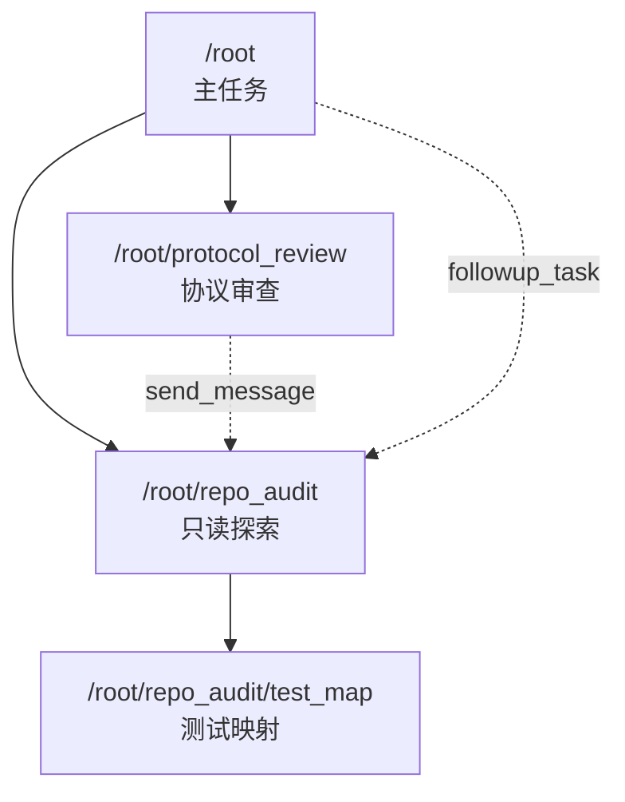

**图 3 — task path 表达任务在协作树中的身份。** 它比一个随机 id 更适合追踪层级、所有权和后续轮次。

### 3.2 V2 的协作工具语义

| 工具 | 解决的问题 |
|---|---|
| `spawn_agent` | 创建有名字、有路径的 child 任务 |
| `send_message` | 向现有任务发送消息，不必启动新 turn |
| `followup_task` | 给已存在任务追加工作，并在空闲时启动新 turn |
| `interrupt_agent` | 打断当前 turn，但保留任务身份 |
| `list_agents` | 按协作树查看活动状态 |

这意味着 V2 的核心收益是**任务可寻址、角色可选择、后续工作可延续**。

### 3.3 `fork_turns` 决定继承多少历史

当前官方 `spawn.rs` 将 `fork_turns` 解析为三类：

```rust
// 来源：openai/codex codex-rs/core/src/tools/handlers/multi_agents_v2/spawn.rs
let fork_turns = self.fork_turns.as_deref() // 读取调用者显式给出的继承策略
    .map(str::trim)                         // 去掉首尾空白，避免伪造新取值
    .filter(|value| !value.is_empty())      // 空字符串不算有效配置
    .unwrap_or("all");                     // 未提供时，当前实现默认继承全部历史

if fork_turns.eq_ignore_ascii_case("none") { // none 表示创建无历史 fork 的 child
    return Ok(None);                          // child 只接收任务和角色配置
}
if fork_turns.eq_ignore_ascii_case("all") {  // all 表示 full-history fork
    return Ok(Some(SpawnAgentForkMode::FullHistory)); // 复制父线程完整历史
}
let last_n_turns = fork_turns.parse::<usize>()?; // 正整数字符串表示只继承最近 N 轮
```

**整体控制流：** 解析结果不直接选择模型，而是决定 child 的上下文来源。当前官方实现对 full-history fork 与 role/model override 存在限制，因此“需要同一完整上下文”与“需要异构角色/模型”是两个必须显式权衡的目标，不能把 `fork_turns` 当无关参数。

### 3.4 V1 / V2 对照

| 维度 | V1 | V2 |
|---|---|---|
| 主要身份 | agent id | canonical task path |
| 组织方式 | 运行实例集合 | 有层级的协作任务树 |
| 后续工作 | send/resume | message 与 follow-up 语义分离 |
| 角色 | 可叠加，但目录感较弱 | `agent_type` 对应 custom role |
| 通信 | parent 围绕 id 管理 | mailbox 与可寻址任务 |
| 上下文 | 继承当前有效配置 | `fork_turns` 明确历史继承范围 |
| 第三方互操作 | 已审计路径较直接 | 增加 encrypted schema 与 `agent_message` 边界 |

---

## 4. Codex 原生 V2 的完整结构

### 4.1 六层结构

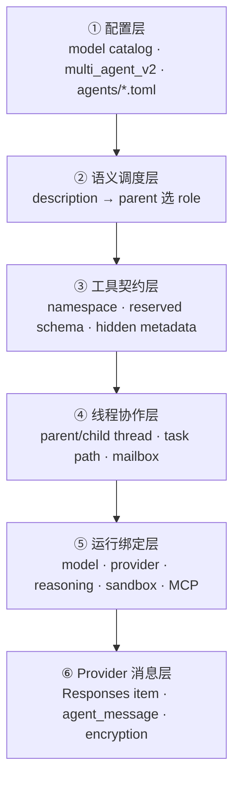

**图 4 — 原生 V2 不是一个函数，而是一条六层链。** “role TOML 已生成”只证明配置层存在，不能证明 parent 实际选角、child 使用了目标 Provider 或消息被上游接受。

### 4.2 配置层：catalog、feature 和 role

原生 V2 至少涉及三类信息：

1. model catalog 告诉 Codex 某模型使用 `multi_agent_version = "v2"`；
2. `[features.multi_agent_v2]` 决定 namespace、metadata 可见性等工具投影策略；
3. `[agents]` 与独立 role 文件定义角色目录及 child session 配置层。

一个最小 custom role 概念示例：

```toml
# ~/.codex/agents/repo_explorer.toml
name = "repo_explorer" # 角色的稳定标识，供目录和 agent_type 引用
description = "Use for read-only repository exploration and evidence collection." # 给 parent 的选角提示
developer_instructions = "Inspect only; do not edit files. Return paths and evidence." # child 被选中后的行为边界
model = "gpt-5.6-terra" # child session 的运行模型覆盖
model_reasoning_effort = "medium" # 该 child 的推理强度覆盖
```

**整体控制流：** `description` 影响 parent 是否选择这个 role；`developer_instructions` 在选择之后约束 child；`model` 与 effort 决定实际运行绑定。三个层面不能互相替代。

### 4.3 官方 `SpawnAgentArgs` 的机制切面

```rust
// 来源：openai/codex .../multi_agents_v2/spawn.rs；为讲解压缩了派生属性
struct SpawnAgentArgs {
    message: String,                      // 要交给 child 的任务正文
    task_name: String,                    // 形成 canonical task path 的任务名
    agent_type: Option<String>,           // 选择 custom role，而不是任务名的别名
    model: Option<String>,                // 可选的显式 child 模型覆盖
    reasoning_effort: Option<ReasoningEffort>, // 可选推理强度覆盖
    service_tier: Option<String>,         // 可选服务层覆盖
    fork_turns: Option<String>,           // none/all/N：历史继承范围
    fork_context: Option<bool>,           // V2 中拒绝的旧兼容字段
}
```

**整体控制流：** handler 先解析任务与 fork mode，再构建 child config；非 full-history 模式才应用 role，随后应用 model、service tier 和 runtime override，构造 task path 与通信对象，最后交给 `AgentControl` 创建 child。`task_name` 和 `agent_type` 在源码中进入不同分支，所以把任务名写成 role 名不会自动选中 custom role。

### 4.4 完整原生时序

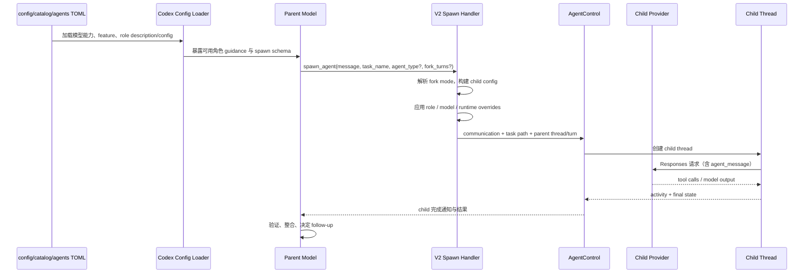

### 4.5 线程层的重要对象

- **parent thread / parent turn**：确定 child 从哪个执行现场被创建；
- **task path**：确定协作树身份，例如 `/root/repo_audit`；
- **communication**：包含作者、接收者、正文与是否触发 turn；
- **activity item**：记录 started/completed 等可见状态；
- **mailbox**：让 `send_message` 和 `followup_task` 能定位既有任务；
- **child config snapshot**：用于获取 nickname、runtime 等实际配置结果。

这说明 V2 “能创建 child”与“child 运行了期望角色/模型”是两个验证层级。后者必须检查实际 child config、Provider 请求或 rollout 证据。

---

## 5. 为什么 V2 Role 必须有能力描述

### 5.1 角色由三部分组成

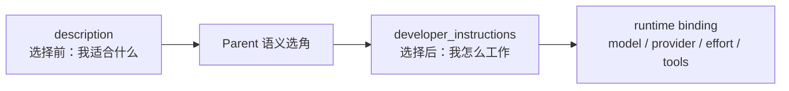

**图 5 — description、instructions、runtime binding 分别回答“选谁、怎么做、在哪里跑”。** nickname 只是可读显示名，也不能承担选角。

### 5.2 `task_name` 为什么不能替代 `agent_type`

`task_name` 的职责是建立路径。假设 parent 调用：

```jsonc
{
  "task_name": "deepseek_flash", // 这里只会生成 /root/deepseek_flash 任务路径
  "message": "审计仓库结构"      // 并没有声明 agent_type
}
```

这不会因为路径看起来像角色名，就自动加载 `deepseek_flash.toml`。官方 handler 明确从 `args.agent_type` 计算 `role_name`，再传给 `apply_spawn_agent_role`。所以正确语义是：

```jsonc
{
  "task_name": "audit_router",       // 任务叫 audit_router
  "agent_type": "deepseek-v4-flash", // 角色叫 deepseek-v4-flash
  "fork_turns": "none",              // 异构 role 使用独立上下文
  "message": "只读审计路由代码"      // 角色这一次的具体任务
}
```

### 5.3 为什么需要语义描述，而不是模型名列表

模型名只能表示运行时标识，无法回答：

- 擅长长上下文阅读，还是复杂跨模块实现？
- 是否只读？是否允许有限修改？
- 追求速度、成本还是最高质量？
- 是否拥有最终集成、合并和发布责任？
- 什么情况下应优先，什么情况下应排除？

例如两个角色都可能来自同一模型家族：

| 角色 | description 的选择语义 | developer instructions | runtime |
|---|---|---|---|
| Flash Explorer | 长上下文阅读、仓库探索、证据收集；排除复杂实现 | 只读、返回路径与证据 | 快速/均衡模型 |
| Pro Engineer | 复杂调试、架构、跨模块实现；排除泛化资料收集 | 可在授权范围内改动并验证 | 高质量/高推理模型 |

Parent 依据任务语义做 best-effort 选择。这里必须强调：**description 是 guidance，不是确定性路由表。** 真正的 Provider 路由仍由 role 的 runtime binding 和后端路由实现完成。

### 5.4 Reserved schema 让能力目录更重要

当 `hide_spawn_agent_metadata=true` 时，parent 看不到或不能安全地在每次调用里展开 model、reasoning 等 metadata；如果强行给 server-reserved `collaboration.spawn_agent` 增加字段，官方后端可能在模型推理前以 schema 不匹配拒绝整个请求。此时稳定的 role 目录承担了“先定义、后选择”的配置职责：parent 只需选择已登记角色，runtime 从 role config 解析模型和推理强度。

这仍然不等于“description 可以绕过 schema”。如果 reserved tool 连 `agent_type` 都不暴露，parent 也无法仅靠 task_name 使用 custom role；相关现象只能按具体 Codex 版本和 schema 验证，不能用描述文字掩盖工具契约缺失。

---

## 6. 原生 V2 为什么不能直接把任务交给第三方模型

“协议不兼容”这个说法太粗。实际至少有四个相互独立的障碍；修掉其中一个，不代表链路已经打通。

### 6.1 四层失败漏斗

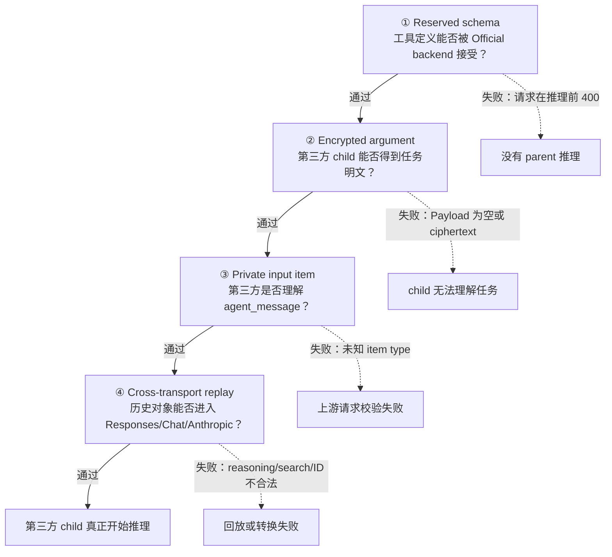

### 6.2 障碍一：server-reserved schema

部分模型把 `collaboration.spawn_agent` 视为后端保留工具，并要求客户端提交的 JSON schema 与模型配置完全一致。CCSM 的旧方案曾设置 `hide_spawn_agent_metadata=false`，使 schema 暴露 `model`、`reasoning_effort`、`service_tier`。对保留工具来说，这不是“多几个可选字段”，而是契约变更；公开 issue [#32674](https://github.com/openai/codex/issues/32674) 给出了推理前 400 的复现。

因此第一条硬边界是：**不能修改 reserved `collaboration.*` 来换取第三方路由 metadata。**

### 6.3 障碍二：协作正文加密

V2 可把 `spawn_agent`、`send_message`、`followup_task` 的 `message` 参数标记为 encrypted。Official backend 返回的是不透明参数，Codex 再将任务放入 `agent_message.content[].encrypted_content`。第三方 Provider 没有 OpenAI 的解密能力。

这也是为什么“改 namespace 后不再 400”仍然可能得到空 Payload：namespace 只解决第一层，encrypted marker 仍在第二层。

### 6.4 障碍三：`agent_message` 是 Codex 私有 input item

即使正文已经是明文，child 请求仍可能长这样：

```jsonc
{
  "input": [{
    "type": "agent_message", // Codex 的协作 item，不是通用 Responses message
    "author": "/root",       // 发送者任务路径
    "recipient": "/root/a", // 接收者任务路径
    "content": [{"type": "input_text", "text": "检查路由"}]
  }]
}
```

许多第三方 Responses-compatible API 只实现标准 `message`；Chat API 更只接受 `messages[]`。因此必须在 Provider 已知后，把可读内容投影成标准 user message。

### 6.5 障碍四：跨 transport 历史回放

一次 child turn 不只有当前 task，还可能包含 reasoning item、web search call、加密 content、函数调用 id 和之前的 Responses 对象。不同 Provider 对以下内容的约束不同：

- reasoning 是否允许明文、是否需要加密签名；
- item id 是否只能由目标 Provider 自己生成；
- web search call 是否为该端点支持的 item；
- Responses input 如何转换成 Chat `messages[]`；
- Anthropic Messages 对 tool use/result 的配对要求。

所以“把 `agent_message` 改名为 `message`”仍不是完整适配。历史和 transport 必须按真实上游归一化。

### 6.6 原生失败时序

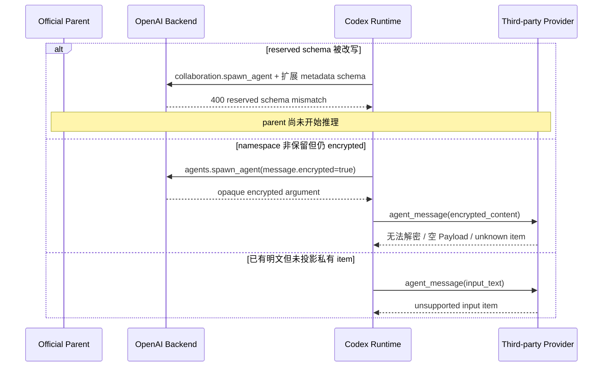

这解释了为什么 V1 可用不能证明 V2 可用：二者经过的工具 schema、协作消息和 input item 路径并不相同。

---

## 7. CCSM 的适配原则：不接管 Orchestrator，只补齐边界

### 7.1 加入 CCSM 前后

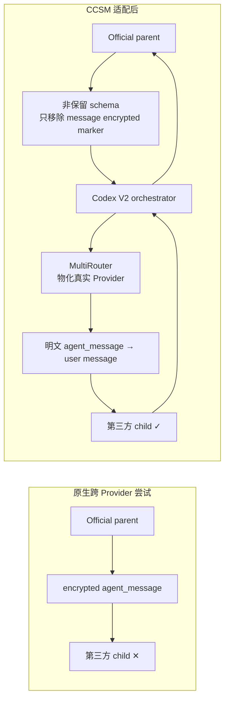

**图 7 — CCSM 不创建 task path、不管理 mailbox、不回收 child 状态。** 这些仍由 Codex V2 完成；CCSM 负责让配置可发现、路由可物化、消息可被真实目标 transport 理解。

### 7.2 五条不可破坏的原则

1. `collaboration.*` reserved schema 保持不变；
2. CCSM 不解密 OpenAI ciphertext；
3. Official → Official 保留原生 OAuth 与加密语义；
4. 只有实际第三方目标已知后才投影 `agent_message`；
5. CCSM 不把 prompt、reasoning、response 正文额外写入数据库或 sidecar 日志。

---

## 8. CCSM 完整架构：控制面与数据面

### 8.1 控制面：把“用户想要什么角色”编译为 Codex 能使用的配置

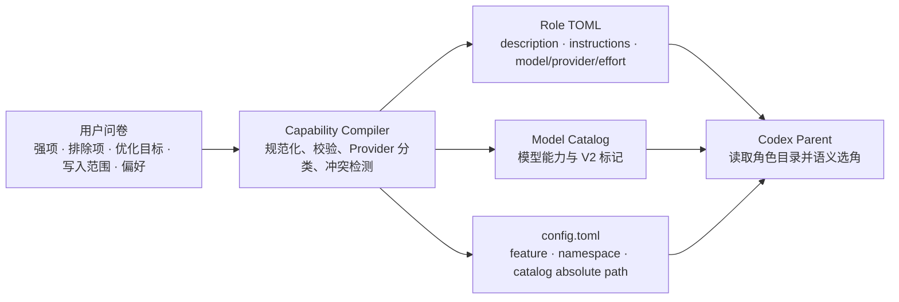

#### 8.1.1 Capability compiler 的最小真实切面

```rust
// 来源：src-tauri/src/codex_subagent_profiles.rs
fn generated_description_for_provider( // 生成给 parent 阅读的能力描述
    policy: SelectionPolicy,            // 全局选角策略：如 official-first
    p: &ParsedCodexSubagentProfile,     // 已校验和规范化的问卷 profile
    provider_kind: ProviderKind,        // 来自 Provider record，不靠模型名猜测
) -> String {
    if let Some(description) = &p.overrides.description { // 用户显式覆盖时
        return description.clone();                       // 完全使用手写语义
    }
    format!(
        "This role matches delegated {} tasks. It excludes {} ... {}",
        joined_strengths(&p.strengths),       // 把擅长任务编入选择提示
        excluded_strengths(&p.strengths),     // 把排除任务编入负向边界
        selection_behavior(policy, p.preference, provider_kind), // 编入优先级
    )
}
```

**整体控制流：** backend 是唯一编译器。它读取已经持久化的 `subagentV2` 问卷，对 profile 做规范化、验证和 Provider 分类，再生成 role。前端不各自拼装 description，避免 preview、保存结果和实际投影出现三套逻辑。

#### 8.1.2 Role 为什么绑定统一 Router，而不是静态第三方 endpoint

CCSM 生成的 role 绑定统一 `codex_model_router_v2` provider，model 则是 catalog 中可路由的模型。这样做保留：

- exact / prefix / default route 解析；
- `targetProviderId` 指向的认证材料；
- route `modelMap` 与 apiFormat；
- Responses、Chat、Anthropic 的转换；
- 账户池、retry 和 Official OAuth 边界。

如果 role 直接写死第三方 provider，就会绕过 MultiRouter 的运行时物化，配置面与实际请求面失去统一真相来源。

#### 8.1.3 Mixed-router 的工具策略

CCSM 对包含第三方 route 的 MultiRouter 投影：

```toml
[features.multi_agent_v2]
tool_namespace = "agents"          # 使用非保留 namespace，避免改写 collaboration schema
hide_spawn_agent_metadata = true   # 不把 model/effort/tier 扩展进 reserved 契约
```

纯 Official router 不会被强制切成非保留 namespace。这个差异由 `mixed_router_uses_non_reserved_agents_tool_namespace` 和 `official_only_router_does_not_force_non_reserved_tool_namespace` 两组回归测试锁定。

### 8.2 数据面：只在正确边界做两阶段兼容

#### 8.2.1 Stage A：让 Official parent 生成可投递明文

Stage A 只发生在：

- 当前应用是 Codex；
- 请求来自 Official/OAuth parent；
- 当前 MultiRouter 至少有启用的第三方或所有权不明确 route；
- 工具是非保留 `agents.spawn_agent / send_message / followup_task`。

它只删除 `parameters.properties.message.encrypted` 标记，同时覆盖顶层 `tools` 和 Responses Lite 的 `additional_tools`。它不触碰 reserved `collaboration.*`，也不修改其他 encrypted 字段。

#### 8.2.2 Request-local 标记跨过 retry/materialization

路由可能在 `forward()` 之前被解析并物化。为了避免后续丢失 Stage A 的原因，CCSM 只把一个布尔量传播到 effective provider：

```jsonc
{
  "codexRouterPlaintextV2Collaboration": true // 说明本请求来自 mixed-router 明文协作策略
}
```

不复制整个 router，也不二次路由。这样既保留因果信息，又减少状态漂移。

#### 8.2.3 Provider materialization

```rust
// 来源：src-tauri/src/proxy/providers/codex.rs
pub fn materialize_codex_routed_provider_from_target(
    route_provider: &Provider,  // 本次 model route 的匹配结果
    target_provider: &Provider, // 数据库中真实上游 Provider
) -> Provider {
    let mut materialized = target_provider.clone(); // 先继承真实 URL、认证和转换配置
    materialized.id = route_provider.id.clone();    // 保留 request-local 路由身份
    materialized.name = route_provider.name.clone();// 保留日志/统计中的路由名称
    // 随后只叠加 route id、capabilities、apiFormat、model override
    // 以及 codexRouterPlaintextV2Collaboration 等必要标记
    materialized
}
```

**整体控制流：** route 按请求 `model` 做 exact/prefix/default 解析，得到 `targetProviderId`；物化以真实 Provider 为底座，因而认证、base URL 和 transport 配置不会丢失，再叠加本次 route 的模型映射和兼容标记。它不修改 GUI 的 current provider，也不会把一个请求变成跨模型故障转移池。

#### 8.2.4 Stage B：只对真实第三方 Responses child 投影

```rust
// 来源：src-tauri/src/proxy/forwarder.rs
fn should_project_codex_agent_messages_for_provider(
    app_type: &AppType,  // 必须确认调用方是 Codex
    provider: &Provider, // 必须使用物化后的真实 Provider 身份
    endpoint: &str,      // 必须是 Codex Responses endpoint
) -> bool {
    matches!(app_type, AppType::Codex)                 // 排除其他应用
        && is_codex_responses_endpoint(endpoint)       // 排除非 Responses 路径
        && !provider.is_codex_oauth()                  // 保护 managed Official OAuth
        && !is_codex_official_provider(provider)       // 保护其他 Official 身份
}
```

**整体控制流：** 判断发生在真实路由目标已知后，而不是根据模型名字猜测。Official/OAuth、普通 OpenAI API 请求、非 Responses endpoint 都跳过；因此原生 Official 语义不会被“为了兼容第三方”而全局降级。

#### 8.2.5 `agent_message` 投影与 fail closed

```rust
// 来源：src-tauri/src/proxy/providers/codex_multi_agent.rs
if item.get("type").and_then(Value::as_str) != Some("agent_message") {
    continue; // 普通 Responses item 原样保留
}
if looks_like_codex_opaque_encrypted_content(encrypted_content) {
    return Err(opaque_agent_payload_error()); // 不能解密就明确失败，不发送空任务
}
*item = json!({
    "type": "message",          // 投影为通用 Responses message
    "role": "user",            // child 的任务必须具有用户输入语义
    "content": projected_content // 只包含已确认可读的 input 内容
});
```

**整体控制流：** 明文 `input_text`、兼容桥遗留的明显明文、文件/图片/音频等可读 part 被保留；像真实 ciphertext 的 Base64 内容会显式报错。投影结果再进入既有 Responses → Chat/Anthropic converter。这里没有任何解密步骤。

#### 8.2.6 完整数据面时序

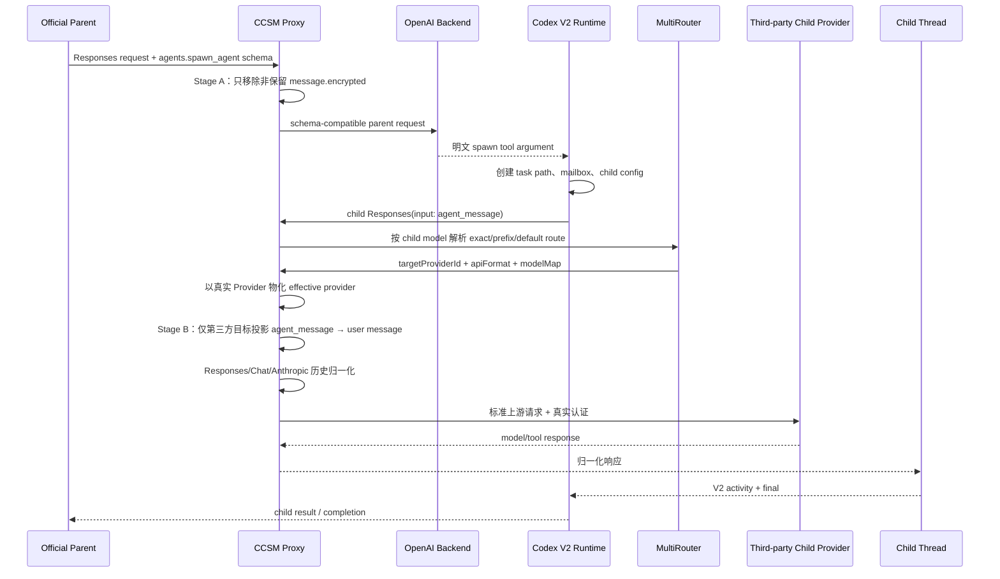

**图 9 — 两个阶段绝不能合并。** Stage A 发生在 parent schema 发送前，此时只知道 router 拓扑；Stage B 发生在 child route 物化后，此时才知道是否真的到第三方。

---

## 9. 一个新 V2 Role 从问卷到第三方 Child 的完整过程

下面以“DeepSeek Flash 型只读探索角色”为例。示例名称用于解释机制，不承诺任意模型在任意时刻都可用；实际可用性取决于 Provider 配置和运行验证。

### 9.1 第一步：用户表达语义意图

| 问卷维度 | 示例选择 | 进入编译器后的作用 |
|---|---|---|
| 任务强项 | 长上下文阅读、仓库探索、证据收集、总结 | 形成 description 的正向匹配 |
| 排除能力 | 复杂调试、架构、复杂实现、高风险审查 | 形成负向边界 |
| 优化目标 | 速度 | 进入 description 和 instructions |
| 写入范围 | 只读 | child instructions 明确禁止改文件 |
| 偏好 | eligible / third-party-first 下优先 | 与全局 selection policy 合成 |
| reasoning | medium | 写入 role runtime binding |

### 9.2 第二步：编译为三段式 Role

概念性输出如下：

```toml
name = "deepseek-v4-flash" # 经过规范化与冲突检测后的 role name
nickname = "DeepSeek Flash" # 仅用于可读显示，不参与硬路由
description = "This role matches delegated long-context reading, repository exploration, evidence collection, summarization, and testing tasks. It excludes complex debugging, architecture design, complex implementation, and high-risk review..." # parent 选择提示
developer_instructions = "Work only on delegated exploration and evidence tasks. Keep all work read-only. Return concrete evidence to the parent..." # child 行为边界
model = "deepseek-v4-flash" # MultiRouter catalog 中的可见模型
model_provider = "codex_model_router_v2" # 统一路由入口，而非静态第三方 endpoint
model_reasoning_effort = "medium" # child 运行强度
```

每一行的职责都是单一的：name 定位 role；nickname 显示；description 选角；instructions 执行；model/provider/effort 运行。存在同名用户 role 时，CCSM 会按安全规则生成 `ccswitch-...` 名称；没有 CCSM ownership marker 的用户文件不会被覆盖。

### 9.3 第三步：写入并投影

Compiler 输出进入三个投影面：

1. `~/.codex/agents/<role>.toml`：role 配置；
2. CCSM model catalog：可见模型、能力、V2 transport；
3. `~/.codex/config.toml`：catalog 绝对路径、router provider、feature/namespace。

只有 effective current Provider 才更新 live projection。编辑一个非 current Provider 时，数据库配置可以保存，但函数返回 `NotRequired`，不会改写当前 Codex 文件；这是为了避免“编辑未启用供应商却悄悄切换运行环境”。

### 9.4 第四步：Parent 发现并选择

新会话加载配置后，parent 看到 role description。收到“只读探索仓库，返回源码锚点”的任务时，它可以选择：

```jsonc
{
  "task_name": "inspect_router",          // 在协作树中建立 /root/inspect_router
  "agent_type": "deepseek-v4-flash",      // 选择编译出的角色
  "fork_turns": "none",                   // 避免 full-history 与异构 override 冲突
  "message": "只读检查路由物化链并返回路径与函数名"
}
```

“可以选择”仍是 best-effort。要证明真实选角，不能只看 TOML；至少要核对 child task/role、实际 model/provider、工具行为和路由日志。

### 9.5 第五步：真实第三方请求与结果回收

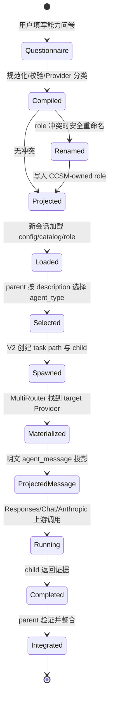

### 9.6 Flash 与 Pro 角色的差异

| 维度 | Flash Explorer | Pro Engineer |
|---|---|---|
| 目标 | 快速长文阅读、仓库探索、证据收集、测试观察 | 复杂调试、架构设计、跨模块实现、高风险审查 |
| 写入 | 只读 | 复杂改动，但限于委派目标 |
| 排除项 | 复杂实现与高风险决策 | 泛化资料收集与简单摘要 |
| 返回物 | 路径、证据、摘要、测试结果 | 根因、设计、实现、验证、风险 |
| Parent 保留 | 最终整合、合并、发布 | 最终整合、合并、发布 |

能力描述之所以必要，正是为了让 parent 看见这种差异；Provider 路由之所以仍然必要，是为了让选中的角色真正落到相应的第三方 runtime。

---

## 10. 踩过的坑：看似合理，为什么仍然错

| 错误方案 | 表面上解决了什么 | 真正失败点 | 根治原则 / 回归锚点 |
|---|---|---|---|
| 给 reserved spawn schema 加 model/effort | parent 可显式指定模型 | 后端在推理前校验失败 | reserved schema 不改；`hide_spawn_agent_metadata=true` |
| 只把 namespace 改成 `agents` | 避免 reserved 名称冲突 | `message.encrypted` 仍产生 ciphertext | Stage A 只移除非保留消息加密标记 |
| 把 task_name 写成 role 名 | 路径看起来像角色 | handler 只从 `agent_type` 应用 role | 分离 task identity 与 role identity |
| 只检查 role TOML 存在 | 配置文件已生成 | parent 可能未选角，child 可能继承 parent | 验证 child rollout、model/provider 和工具行为 |
| role 直接绑定第三方 endpoint | 配置更“直观” | 绕过认证、modelMap、apiFormat 和 retry | 绑定统一 router，运行时物化 target Provider |
| 对所有 Provider 投影 `agent_message` | 第三方可能能读 | 破坏 Official OAuth 原生语义 | 只在真实第三方 Responses 目标执行 |
| 把 opaque ciphertext 当文本发送 | 避免本地报错 | child 得到不可读内容或空 Payload | fail closed，明确指出需 mixed-router 明文路径 |
| 按模型名猜 Official/第三方 | 实现简单 | 自定义 slug、managed OAuth 会误判 | 使用 Provider record 与物化身份 |
| 复制整个 router 到 request-local Provider | 标记不丢 | 状态变大、可能二次路由/漂移 | 只传播一个 boolean compatibility marker |
| 修改非 current Provider 时写 live 文件 | “保存即生效” | 悄悄改变当前 Codex 环境 | 非 current 保存返回 `NotRequired` |

### 10.1 为什么这些不是补丁堆叠

这些修复共同服从一条因果边界：

- schema 决策必须在 parent 请求前完成；
- role 决策属于 Codex 配置与 parent 语义调度；
- Provider 身份只有 route 解析后才可信；
- message 投影只有在真实第三方身份已知后才安全；
- transport 归一化必须紧邻真实上游发送；
- Codex orchestrator 继续拥有 task、mailbox、child lifecycle。

把行为放回正确层，比在错误层追加条件判断更重要。

---

## 11. V23 配置解析事故：为什么 Child 还没启动就失败

`v3.19.1-23` 修复的不是第三方 payload 转换算法，而是更靠前的 **config/catalog/role 投影链**。如果 Codex 连 catalog/config 都无法解析，V2 child 根本到不了数据面。

### 11.1 根因一：`model_catalog_json` 从相对路径变成绝对路径语义

CCSM 旧投影写入类似：

```toml
model_catalog_json = "models_manager_models.json" # 旧行为：只写文件名
```

新版 Codex 配置类型要求绝对路径；相对值进入 `AbsolutePathBuf` 解析时失败。旧写入行为由提交 `7811383b` 引入，最早进入 V3.16.2 系列。V23 的根修是以实际 catalog 文件路径写入绝对值，并用 `model_catalog_json_field_writes_absolute_path_required_by_codex` 锁定契约。

### 11.2 根因二：canonical 字段与 legacy alias 同时存在

`max_threads` 是 `max_concurrent_threads_per_session` 的 legacy alias。旧逻辑在 canonical 值已经存在时仍补写 alias，Serde 会把两者视为同一字段出现两次，触发 duplicate field。

```toml
[agents]
max_concurrent_threads_per_session = 8 # canonical 字段
max_threads = 8                        # legacy alias；同时存在会重复解析
```

旧补键逻辑由 `2aef8a2e` 引入，最早进入 `v3.16.3-23`。V23 会迁移并删除 legacy alias，保留用户 canonical 值；回归测试为 `catalog_projection_canonicalizes_agent_thread_aliases`。

### 11.3 失败位置图

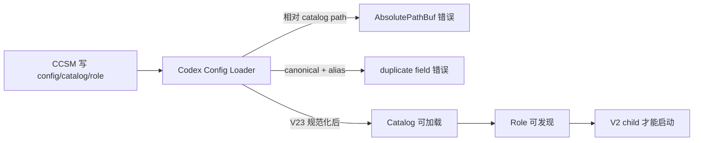

**图 11 — V23 修的是入口阻断。** 它证明 config 投影能被当前 Codex 解析；不应把它误写成“V23 才实现第三方 `agent_message` 兼容”，后者来自更早的数据面实现与测试。

### 11.4 当前发布验证边界

V23 对应 GitHub Actions run `31577095852` 的 Windows x64/ARM64、Linux x64/ARM64、macOS、Release publish 和 `latest.json` assembly 均成功；完整 Rust 结果记录为 `2956 passed / 0 failed / 2 ignored`。这证明源码和发布流水线覆盖的目标成功，不等于每一台受影响机器都完成了 Codex Desktop 新会话、真实 role 选择和第三方 child 的交互验收。

---

## 12. 实现边界与最终结论

### 12.1 CCSM 做了什么

- 把问卷语义编译成可追踪的 custom role；
- 投影 Codex 可解析的 config、绝对 catalog 路径和受控 role 文件；
- 为 mixed-router 选择非保留工具 namespace，并保持 reserved schema 兼容；
- 按 model 解析 route，以真实 Provider 物化认证、协议和 modelMap；
- 只为真实第三方 child 投影可读 `agent_message`；
- 在 Responses/Chat/Anthropic 边界做历史归一化；
- 对 opaque ciphertext 明确失败，不伪造空任务成功。

### 12.2 CCSM 没有做什么

- 没有重新实现 Codex 的 task tree、mailbox、AgentControl 或 child lifecycle；
- 没有解密 OpenAI ciphertext；
- 没有把 description 变成确定性硬路由；
- 没有把 role TOML 的存在当作实际选角证明；
- 没有为了第三方兼容而降级 Official → Official 的原生路径；
- 没有把 GitHub 平台构建替代为用户现场运行验收。

### 12.3 一句话总结完整机制

```text
能力描述解决“Parent 为什么选这个角色”；
Role runtime 解决“Child 应该使用哪个可路由模型”；
MultiRouter 解决“这个模型请求实际去哪个 Provider”；
两阶段 payload 兼容解决“Official Parent 的任务怎样被第三方 Child 正确读到”；
Codex V2 仍然解决“Child 如何被创建、通信、完成并回到 Parent”。
```

这五件事缺一不可，也不能互相冒充。

---

## 13. 参考资料与源码索引

### 13.1 OpenAI 官方文档

- [Subagents：概念、并行工作、custom agent 与模型选择](https://learn.chatgpt.com/docs/agent-configuration/subagents)
- [Codex Config Reference：agents 并发与配置字段](https://learn.chatgpt.com/docs/config-file/config-reference)

### 13.2 OpenAI Codex 官方源码

- [`multi_agents_v2/spawn.rs`：V2 参数、fork、role、task path、child spawn](https://github.com/openai/codex/blob/main/codex-rs/core/src/tools/handlers/multi_agents_v2/spawn.rs)
- [`multi_agents.rs`：V1 handler 与 AgentControl 边界](https://github.com/openai/codex/blob/main/codex-rs/core/src/tools/handlers/multi_agents.rs)
- [`config_toml.rs`：AgentsToml、role 和配置 alias](https://github.com/openai/codex/blob/main/codex-rs/config/src/config_toml.rs)

### 13.3 OpenAI 官方仓库问题复现

- [#32674：reserved spawn schema 与 per-child override](https://github.com/openai/codex/issues/32674)
- [#33551：第三方 Provider 与 `agent_message`](https://github.com/openai/codex/issues/33551)
- [#32705：V2 runtime、metadata、fork 的组合复现](https://github.com/openai/codex/issues/32705)
- [#33267：exec 中 encrypted child output 复现](https://github.com/openai/codex/issues/33267)
- [#32753](https://github.com/openai/codex/issues/32753) / [#28058](https://github.com/openai/codex/issues/28058)：加密协作消息与审计可见性

这些链接是复现证据，不是 OpenAI 对永久架构的承诺。

### 13.4 CCSM 当前源码

- `src-tauri/src/codex_subagent_profiles.rs`：问卷、能力编译、角色命名和 Provider 分类；
- `src-tauri/src/codex_config.rs`：catalog/config/role 投影、V1/V2、namespace 和 V23 配置根修；
- `src-tauri/src/proxy/providers/codex_multi_agent.rs`：`agent_message` 投影与 ciphertext fail closed；
- `src-tauri/src/proxy/providers/codex.rs`：route 解析、真实 Provider 物化和 request-local 标记；
- `src-tauri/src/proxy/forwarder.rs`：第三方投影 gate、transport 转换和发送顺序；
- `src-tauri/src/services/provider/mod.rs`：current / non-current live projection 边界。

### 13.5 CCSM 设计与历史锚点

- [`2026-08-05-codex-cross-provider-v2-subagent-payload-design.md`](superpowers/specs/2026-08-05-codex-cross-provider-v2-subagent-payload-design.md)
- [`2026-08-09-codex-subagent-v1-v2-settings-design.md`](superpowers/specs/2026-08-09-codex-subagent-v1-v2-settings-design.md)
- [`2026-08-10-codex-subagent-capability-injection-design.md`](superpowers/specs/2026-08-10-codex-subagent-capability-injection-design.md)
- Payload：`aa64e5bf`、`4c2854ac`、`21b0ee7a`、`b61bc5b1`、`c47f6b4f`、`8990f746`；
- Capability compiler：`b4e99cca`、`6532f2e1`、`c31e00ce`、`5362a9e3`、`344f2f24`；
- Replay normalization：`4eb154d7`、`063b45dc`、`3f351514`、`8d721273`；
- V23 config fix：`c3976e97`、`4b6f7dfb`、`786248c5`、`99d72136`、`800b1ffd`。

### 13.6 发布证据

- [CCSwitchMulti v3.19.1-23 Release](https://github.com/BigStrongSun/ccswitchmulti/releases/tag/v3.19.1-23)
- [GitHub Actions run 31577095852](https://github.com/BigStrongSun/ccswitchmulti/actions/runs/31577095852)

### 13.7 检索质量说明

本报告按项目要求执行了两条独立联网检索链。Codex 内置 Web 命中并打开了 OpenAI 文档、Codex 官方源码及相关 issue；Matrix WebSearch 独立搜索了相同主题，但本轮只返回泛化 OpenAI/Codex 结果，没有获得等价的一手材料。因此关键结论只使用官方文档、官方源码、CCSM 当前源码/测试和发布运行证据，Matrix 结果不作为正证据。
