# CCSwitchMulti Codex 多路由使用说明

> 适用版本：CCSwitchMulti v3.16.3 及以上。本文面向已经安装 CCSwitchMulti、并希望在 Codex Desktop 里同时使用官方 GPT、DeepSeek、GLM、本地模型等多个模型源的用户。

## 先理解这条链路

Codex Desktop 仍然只看到一个“当前模型提供方”，但这个提供方会被 CCSwitchMulti 接管成一个本地 MultiRouter。你在 Codex 里选择不同模型时，请求先进入 CCSwitchMulti 本地路由，再由路由规则转发到 OpenAI 官方 OAuth、DeepSeek、GLM、OpenAI-compatible 中转站或本地模型。

这里不是把 Codex Desktop 内置 WebSocket 做传统反代。官方 GPT / Codex 侧使用 CCSwitchMulti 托管的 OAuth 授权请求；第三方模型源通常走 OpenAI Chat Completions 或兼容接口，再由 CCSwitchMulti 转换成 Codex 需要的 Responses 形态。

## 准备工作

- 已安装并能启动的 Codex Desktop App。
- 已安装 CCSwitchMulti。
- 一个能登录 Codex Desktop 的 ChatGPT / Codex 账号。
- 你要接入的额外模型源，例如 DeepSeek、GLM、OpenRouter、硅基流动、Ollama / vLLM / LM Studio 等本地服务。
- 每个额外模型源的 Base URL、API Key，以及可用模型名。

> 注意：使用 ChatGPT / Codex OAuth 访问官方 Codex 后端可能涉及服务条款、账号风控和长期可用性风险。不要分享 `~/.codex/auth.json`、OAuth token、refresh token 或真实上游 API Key。

## 总流程速览

1. 在 Codex Desktop App 里先完成官方登录。
2. 在 CCSwitchMulti 的 `设置 → 认证` 里完成 ChatGPT / Codex OAuth 授权。
3. 在 Codex 面板添加 DeepSeek、GLM 或本地模型等“模型源”。
4. 对额外模型源开启 `需要本地路由映射`，填写 Base URL / API Key，获取模型列表并配置上下文窗口。
5. 进入 `Codex 多模型路由` 工作台，创建多路路由方案。
6. 添加并启用路由规则，配置路由名称和匹配模型。
7. 配置 `子 Agent 候选模型`，把希望 Codex 用来创建 subagent 的模型排进前 5 个。
8. 保存排序并选中该多路由方案。
9. 在 `设置 → 路由` 打开路由总开关和 Codex 路由，启动 MultiRouter。
10. 完全退出并重启 Codex Desktop，检查模型列表和请求连通性。
11. 如果历史记录暂时消失，进入会话管理的 `Codex 历史修复`，预览修复并确认写入，再次重启 Codex。

## 1. 先登录 Codex Desktop

先启动 Codex Desktop App，用你的 ChatGPT / Codex 账号完成官方登录。这个步骤的目的不是让所有请求都走官方模型，而是让 Codex Desktop 和 CCSwitchMulti 都有一个健康的官方 OAuth 登录基础。

登录完成后，Codex 会把官方登录材料保存到本机 `~/.codex/auth.json`。后续不要手动复制、编辑或分享这个文件。

## 2. 在 CCSwitchMulti 里完成 OAuth 授权

打开 CCSwitchMulti，进入：

```text
设置 → 认证
```

找到 ChatGPT / Codex OAuth 认证区域，点击 `使用 ChatGPT 登录`，按页面提示完成授权。授权完成后，CCSwitchMulti 会托管这个 OAuth 登录，用于 MultiRouter 里的官方 GPT / Codex 路由。

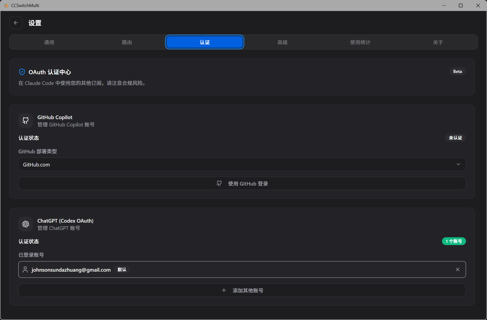

如果授权状态显示未认证、会话过期或无法刷新，请先在这里重新登录，再继续配置多路由。

## 3. 添加额外模型源

回到 Codex 面板，点击右上角加号添加模型源。常见选择包括：

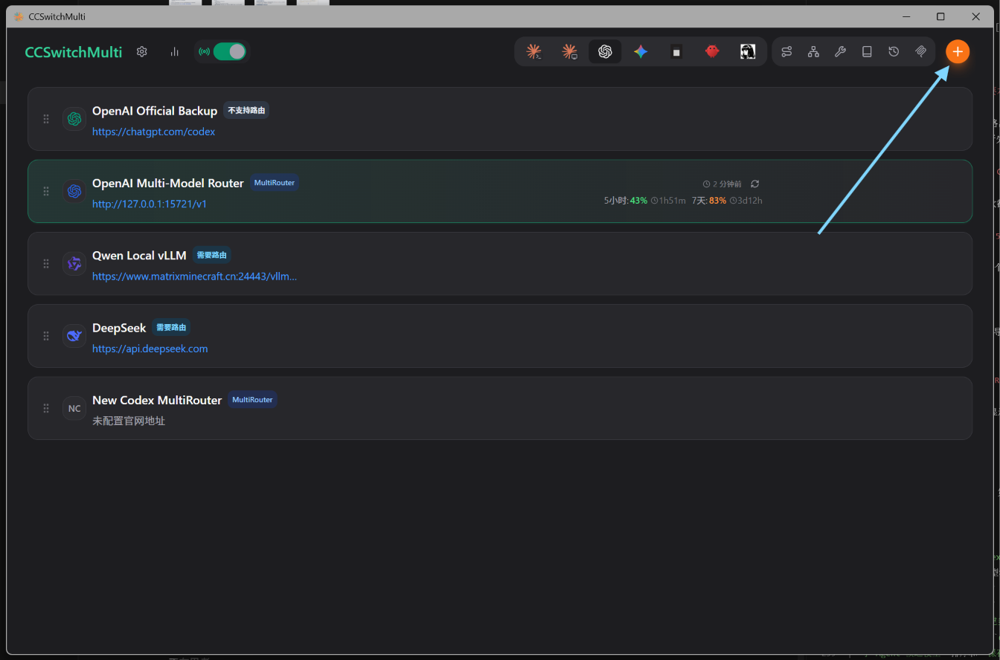

- DeepSeek
- GLM / 智谱
- Kimi / MiniMax / 硅基流动 / OpenRouter 等中转或兼容服务
- 本地部署的 Ollama / vLLM / LM Studio / OpenAI-compatible 服务

添加时至少填写：

- `API 请求地址` 或 `Base URL`
- `API Key`
- 默认模型或模型映射

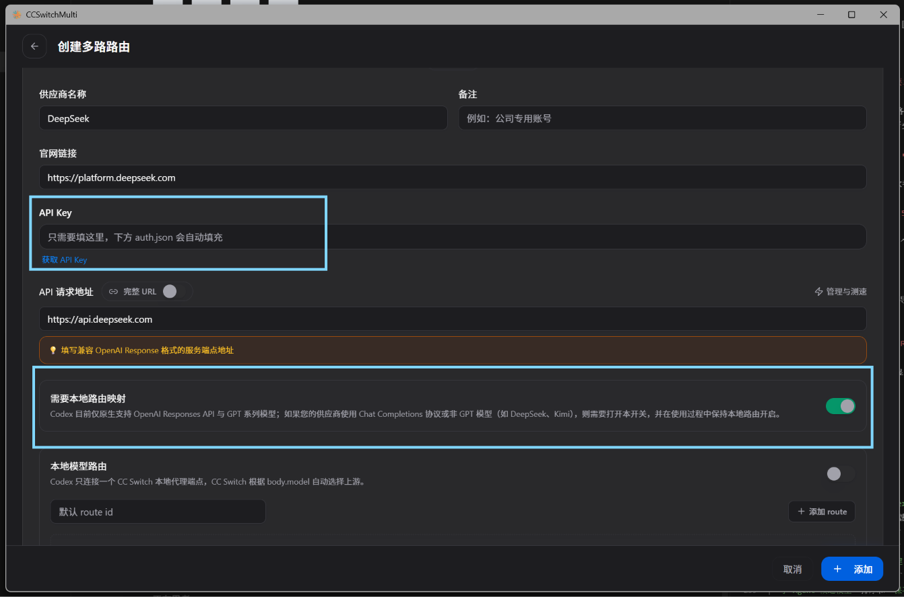

## 4. 开启本地路由映射并获取模型列表

如果额外模型源本身不支持 OpenAI `/v1/responses`，而只支持 `/v1/chat/completions` 或类似 Chat 格式，建议直接开启：

```text
需要本地路由映射
```

这一步很关键。Codex Desktop 和 Codex CLI 强绑定 Responses 风格请求，大多数第三方模型并不原生支持完整 Responses 行为。开启本地路由映射后，CCSwitchMulti 会在本地把 Codex 的 Responses 请求转换给第三方接口，再把返回结果转换回 Codex 能读的响应。

继续向下展开 `高级选项`，找到 `模型映射`：

1. 点击 `获取模型列表`。
2. 等待 CCSwitchMulti 从该模型源拉取可用模型。
3. 检查每个模型的显示名。
4. 为模型填写或确认 `上下文窗口`。
5. 保存模型源。

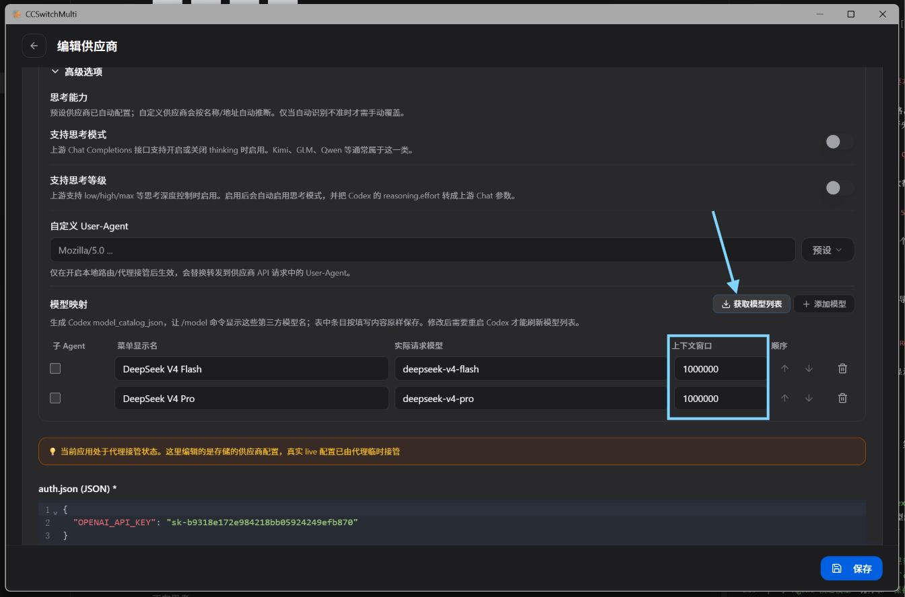

如果 `获取模型列表` 失败，先检查 Base URL、API Key、网络和该服务是否真的暴露 `/models` 或兼容模型列表接口。模型列表失败不会自动证明模型不可用，但会影响 MultiRouter 候选模型和子 Agent 候选排序。

## 5. 创建 Codex 多模型路由

在 CCSwitchMulti 右上角找到路径 / 路由形状的入口，打开：

```text
Codex 多模型路由
```

进入工作台后，点击 `创建多路路由`。这里创建的不是普通上游模型源，而是一套 Codex MultiRouter 方案。它会引用你刚才配置好的 OpenAI 官方 OAuth、DeepSeek、GLM、本地模型等模型源。

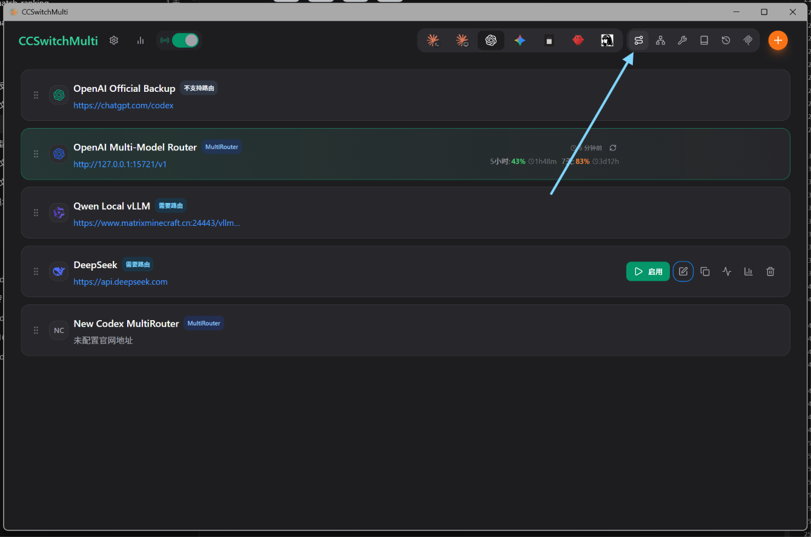

目前建议为每套方案起一个清晰名称，例如：

- `Codex GPT + DeepSeek + GLM`
- `Codex OpenAI + Local vLLM`
- `Daily MultiRouter`

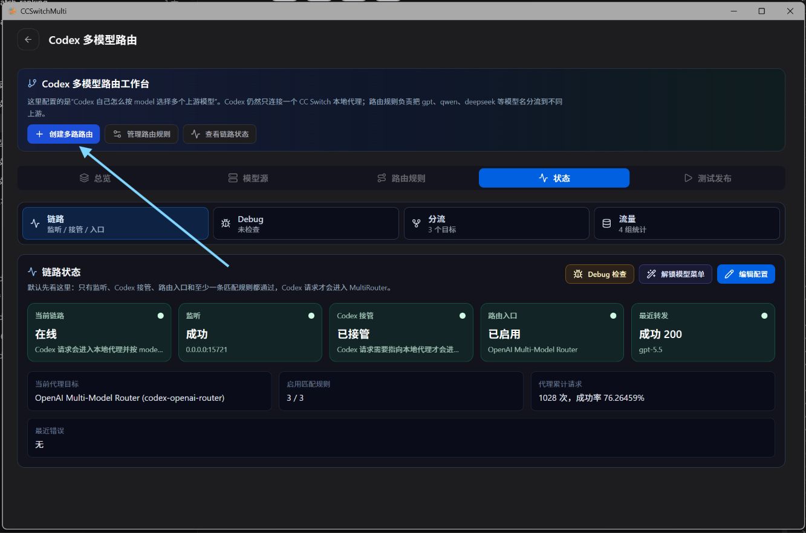

## 6. 添加并启用路由规则

在工作台进入 `路由规则` 页，点击 `编辑匹配规则` 或添加规则。选择你希望加入这套 MultiRouter 的模型源，并确认它们处于启用状态。

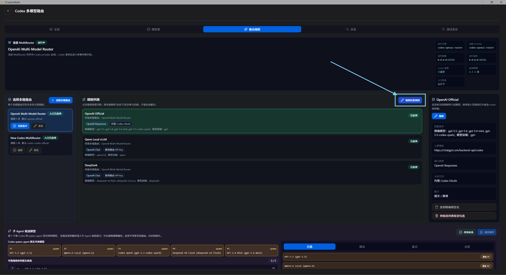

每条规则至少要确认：

- 路由名称：给用户看的名称，例如 `DeepSeek`、`GLM`、`Local vLLM`。
- 匹配模型：Codex 请求里的模型名，例如 `deepseek-v4-flash`。
- 上游模型：第三方接口真实接收的模型名。
- 认证方式：第三方模型通常使用路由 API Key；官方 GPT / Codex 路由使用托管 Codex OAuth。
- 能力声明：文本、图文、是否支持推理等。

规则配置完成后，保存路由方案。

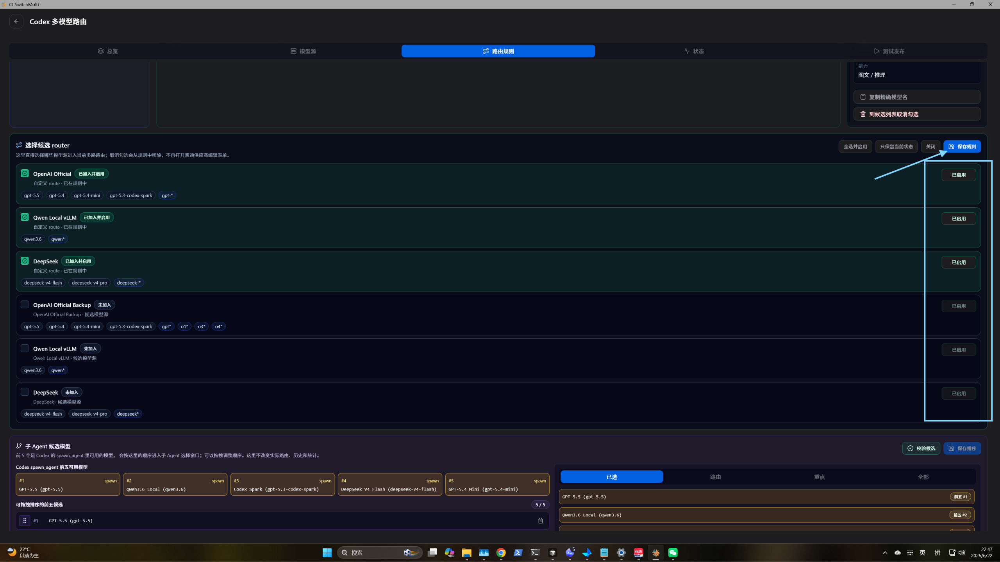

## 7. 配置子 Agent 候选模型

在 `路由规则` 页下方找到 `子 Agent 候选模型`。这里控制 Codex 创建 subagent 时能看到哪些模型。

这个列表需要手动整理，原因是 Codex 只取前 5 个模型作为 subagent 可用候选。如果不整理，模型顺序可能来自自动发现或历史配置，导致真正想用的 DeepSeek、Qwen、本地模型排在后面，Codex 创建子 Agent 时看不到。

建议做法：

1. 把你最希望用于 subagent 的模型拖到前 5 个。
2. 前 5 个里保留一个官方 GPT 作为兜底。
3. 给长上下文任务放 `deepseek-v4-flash` 或你实际验证过的长上下文模型。
4. 给本地 / 多模态任务放对应的本地模型或 Qwen 系模型。
5. 点击 `保存排序`。

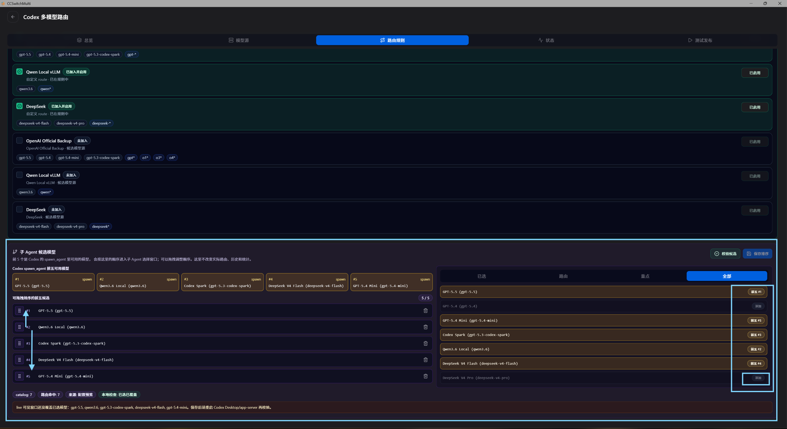

保存后，MultiRouter 会把这个顺序写入模型目录。Codex Desktop 仍然需要重启后才会刷新模型候选。

## 8. 选中 MultiRouter 并启动路由

回到 CCSwitchMulti 主界面，选中刚才创建的 MultiRouter 方案。

再进入：

```text
设置 → 路由
```

依次打开：

1. 路由总开关。
2. Codex 路由开关。

然后启动本地路由服务。默认情况下，Codex takeover 端口通常是：

```text
127.0.0.1:15721
```

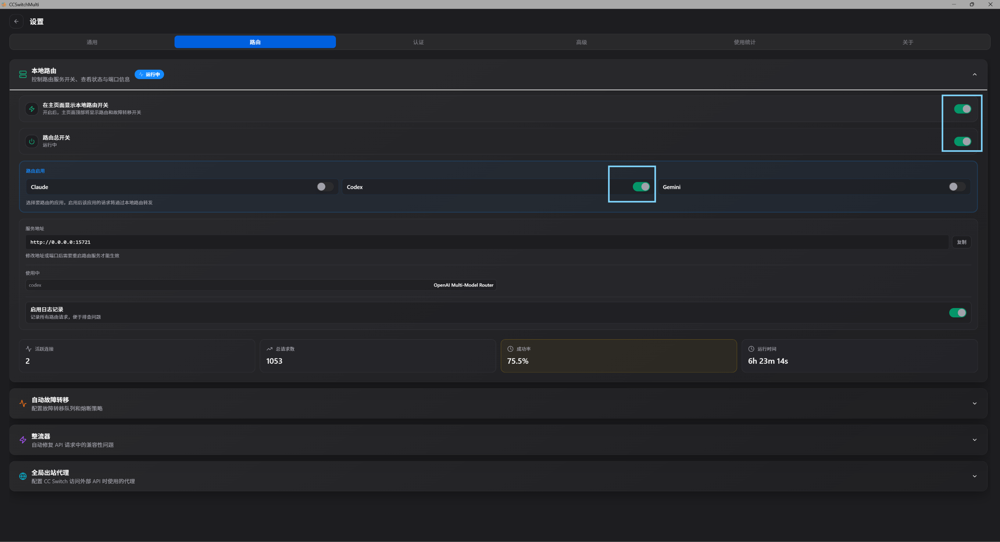

不要把这个端口和对外 OpenAI-compatible API 端口混淆。Codex Desktop takeover 使用的是本地 Codex 路由端口；外部 agent API 可能使用另一个端口。

## 9. 使用状态 / Debug 检查链路

启动后，回到 `Codex 多模型路由` 工作台，进入 `状态` 页，运行 Debug 检查。

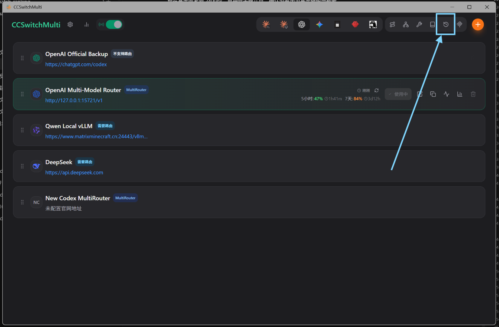

重点看这些结果：

- 本地代理是否运行。
- Codex live config 是否指向 CCSwitchMulti 本地路由。
- 当前 MultiRouter 方案是否被选中。
- 启用路由数量是否正确。
- 模型目录是否包含你配置的模型。
- 最近日志里是否出现 `route_resolved`、`request_prepared`、`upstream_send`、`upstream_status`。

如果 Debug 里显示端口可达但没有近期路由事件，请先在 Codex Desktop 里发送一条测试消息，再回来看日志。没有日志通常说明 Codex 还没有真正走到 MultiRouter，而不是第三方上游一定坏了。

## 10. 完全退出并重启 Codex Desktop

完成 MultiRouter 配置后，必须完全退出 Codex Desktop App，再重新启动。

重启是必要步骤，因为 Codex Desktop 通常在启动时读取：

- `~/.codex/config.toml`
- `model_catalog_json`
- `models_cache.json`
- Desktop 内部模型候选快照

只在 CCSwitchMulti 里保存配置，不一定会让正在运行的 Codex Desktop 热刷新模型菜单。

重启后检查：

1. 模型候选列表里是否出现你新增的 DeepSeek、GLM、本地模型等。
2. 官方 GPT 路由是否仍可用。
3. 给 Codex 发送一条简单测试消息。
4. 回到 CCSwitchMulti 状态页确认请求命中了正确路由。

如果模型候选仍然只有少数 OpenAI 模型，优先确认所有 Codex Desktop / app-server 进程已经完全退出；必要时从 CCSwitchMulti 重新启动或解锁 Codex Desktop，再检查模型列表。

## 11. 修复 Codex 历史记录显示

切到 MultiRouter 后，Codex 历史记录可能看起来被清空。这通常不是对话文件丢失，而是历史记录的 provider bucket 从官方或旧路由桶切到了新的 MultiRouter 桶。

进入右上角倒数第二个时钟 / 会话管理入口，打开：

```text
会话管理 → 历史修复
```

在 `Codex 历史修复` 面板里：

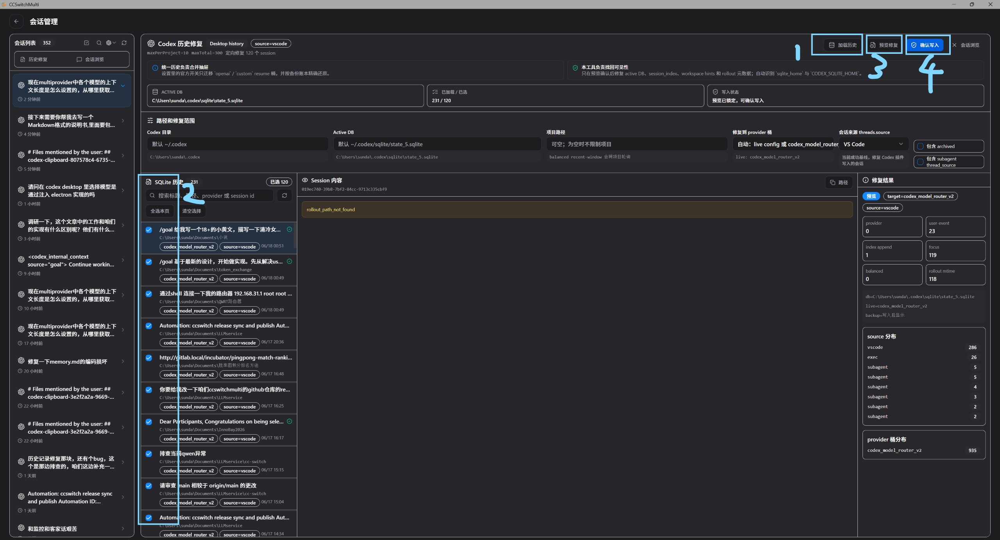

1. 点击 `加载历史`，让工具读取 active SQLite 历史。
2. 如果要把当前页结果全部纳入修复，使用全选当前加载页。
3. 其他选项不确定时保持默认。
4. 点击 `预览修复`。
5. 确认预览结果、目标 provider、active DB 和计数正常。
6. 点击 `确认写入`。

写入完成后，再次完全退出并重启 Codex Desktop。历史记录应该重新出现在 Codex 的会话列表中。

更多历史机制和数据安全说明可参考 [统一 Codex 会话历史：功能介绍与使用攻略](./codex-unified-session-history-guide-zh.md)。

## 常见问题

### 为什么额外模型源建议开启“需要本地路由映射”？

因为 Codex 请求是 Responses 风格，而大量第三方模型源只稳定支持 Chat Completions。不开启本地路由映射时，Codex 可能直接请求第三方 `/responses`，常见结果是 404、400、流式格式不兼容或工具调用解析失败。

### 为什么保存模型映射后还要重启 Codex？

Codex Desktop 的模型菜单不是每次都热加载本地 catalog。修改模型映射、上下文窗口或子 Agent 候选顺序后，完整退出并重启 Codex 最稳。

### 为什么子 Agent 候选只强调前 5 个？

Codex 创建 subagent 时只取前 5 个候选模型。`子 Agent 候选模型` 面板就是用来把这 5 个名额显式排好，避免自动顺序把关键模型挤到后面。

### 为什么历史记录看起来没了？

通常是历史 provider bucket 改变导致 Codex 当前列表过滤不到旧会话。先用 `Codex 历史修复` 做 dry-run，再确认写入。这个流程会在写入前备份，不会删除你的 `.jsonl` 会话正文。

### 如何判断请求真的走到了 MultiRouter？

不要只看 Codex 左下角账号或模型显示。以 CCSwitchMulti 状态页、Debug 结果和 `codex-router.log` 为准。出现 `route_resolved` 和对应上游状态，才说明请求进入了 MultiRouter。

## 相关文档

- [Codex 本地模型路由指南](./codex-deepseek-routing-guide-zh.md)
- [使用第三方 API 时保留 Codex 远程操作和官方插件](./codex-official-auth-preservation-guide-zh.md)
- [统一 Codex 会话历史：功能介绍与使用攻略](./codex-unified-session-history-guide-zh.md)
- [添加供应商](../user-manual/zh/2-providers/2.1-add.md)
- [本地路由](../user-manual/zh/4-proxy/4.2-routing.md)
