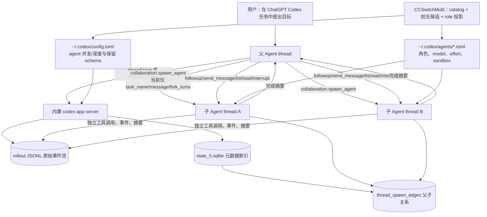

# 新版 GPT App（ChatGPT Codex）线程与多 Agent 机制实测报告

> 核验日期：2026-07-10  
> 范围：Windows `OpenAI.Codex 26.707.3748.0`、本机 `~/.codex` 运行数据、当前 CCSwitchMulti 代码和 OpenAI 公开文档。这里的“GPT App”特指用户正在使用的 ChatGPT Codex Windows 桌面端，不泛指所有 ChatGPT 网页会话。

## 先给结论

新版 GPT App 的多 Agent 不是“在同一条聊天里塞几段子提示词”，而是：**父线程生成独立子线程，建立父子 edge，子线程独立运行工具与模型，主线程接收摘要后再汇总**。

`agent 类型`、`模型`、`推理强度`、`provider/路由`、`候选模型列表`是五件不同的事：

| 概念                        | 它决定什么                                | 不能误解成什么                                        |
| --------------------------- | ----------------------------------------- | ----------------------------------------------------- |
| Agent 类型/role             | 指令、职责、可选工具和权限配置            | 不是模型名                                            |
| 模型                        | 该子线程使用的推理引擎                    | 不是路由规则                                          |
| reasoning effort            | 同一模型投入多少推理/延迟/token           | 不是角色                                              |
| provider/route              | 请求实际发往哪个上游                      | 不等于 Agent 类型                                     |
| `spawnAgentModels` 前五候选 | picker 展示顺序与 CCSwitchMulti role 投影 | **不改变实际路由，也不是 GPT App 服务端的最终调度器** |

你截图的报错与“5.6 是否在候选列表”没有因果关系。根因是旧 CCSwitchMulti 给原生保留工具 `collaboration.spawn_agent` 追加了旧协议的元数据字段；新 GPT/Codex 会在请求的 `tools` 校验阶段拒绝 schema 不一致的保留工具。当前正确策略是保持 `hide_spawn_agent_metadata = true`，由 custom Agent role 文件选择模型，不再向 `spawn_agent` schema 注入 `model`、`reasoning_effort` 或 `service_tier`。

## 总体流程图



## 1. 线程机制：UI、运行时与落盘

### 1.1 当前桌面端的进程分层

本机安装的是 `OpenAI.Codex 26.707.3748.0`。实际进程拓扑如下：

```text
ChatGPT.exe（桌面 UI 壳）
└─ resources\codex.exe -c features.code_mode_host=true app-server
   ├─ codex-code-mode-host.exe
   └─ node_repl.exe（工具运行时）
```

因此桌面 UI 不直接负责线程编排：`codex app-server` 承担会话、权限、工具事件和 Agent 运行时。公开 App Server 文档也把它定义为富客户端使用的接口，协议为双向 JSON-RPC；核心对象是 `thread → turn → item`。[App Server](https://learn.chatgpt.com/docs/app-server)

### 1.2 一条 thread 的生命周期

```text
initialize/initialized
  → thread/start（新线程）或 thread/resume（续接）或 thread/fork（分支）
  → turn/start（一个用户请求）
  → item/started、工具/消息 delta、item/completed 等流事件
  → turn/completed 或 turn/interrupt
```

- `thread/start` 产生独立 `thread.id`；根线程的 `sessionId` 等于自身 id。
- `thread/resume` 继续同一历史；仅 resume 不会刷新时间，开始新 turn 才会刷新。
- `thread/fork` 复制选定历史到新的 thread id，并保留原根 `sessionId`。
- `thread/read` 可离线读历史而不加载/订阅；`thread/list` 支持按 provider、来源、归档、工作目录、父/祖先线程筛选。
- `thread/archive` 会移动 JSONL 且尝试归档所有子孙线程；`thread/delete` 也会级联子孙线程。详情见 [App Server 线程 API](https://learn.chatgpt.com/docs/app-server)。

### 1.3 历史记录的真实存储：不要只修一个索引

本机活跃目录是 `%USERPROFILE%\.codex`，其中：

| 层           | 实际位置                              | 当前观察到的作用                                                                    | 修复原则                                              |
| ------------ | ------------------------------------- | ----------------------------------------------------------------------------------- | ----------------------------------------------------- |
| 原始事件流   | `sessions\YYYY\MM\DD\rollout-*.jsonl` | 完整事件记录；顶层包含 `session_meta`、`turn_context`、`event_msg`、`response_item` | App 运行时绝不手改；离线迁移必须备份且保持 JSONL 一致 |
| 元数据索引   | `state_5.sqlite.threads`              | `rollout_path`、标题、预览、模型、provider、时间、归档、来源、role 等列表字段       | 不可只写它；和 JSONL 同步、关闭 App 后再操作          |
| 父子关系图   | `state_5.sqlite.thread_spawn_edges`   | `parent_thread_id → child_thread_id` 与 open/closed 状态                            | 不能在“恢复父线程”时丢掉                              |
| 动态工具快照 | `thread_dynamic_tools`                | thread 级动态工具定义                                                               | 不伪造/不清空                                         |
| 轻量索引     | `session_index.jsonl`                 | 仅 id、线程名、更新时间                                                             | 不能单独作为历史恢复依据                              |

本机实测：`state_5.sqlite` 有 1,897 条 thread、1,439 条 parent→child edge，其中 1,444 条标为 `thread_source=subagent`。所有 1,897 个 rollout 路径均指向存在的 JSONL；`session_index.jsonl` 的条目数与 `threads` 并不相等，证明它只是辅助索引。App Server 的 `thread/list` 默认会扫描 JSONL 修复 metadata；只有显式 `useStateDbOnly=true` 才跳过扫描。因此 JSONL 是内容真源，SQLite 是可恢复的查询/列表索引，而不是二选一。

这也解释了历史修复的安全边界：CCSwitchMulti 应离线备份后统一修正 rollout 的必要 provider 元数据和 `threads.model_provider`，然后让原生 App Server/桌面端重新建立派生目录；**不能直接伪造 `local_thread_catalog` 或只改 `session_index.jsonl`**。

## 2. 子 Agent 机制：独立 child thread，不是父消息的附件

子 Agent 在持久化层是完整 thread：它有自己的 rollout JSONL、turn/item、模型和权限元数据；同时在 `thread_spawn_edges` 与父 thread 相连，`session_meta` 也保存 `parent_thread_id`。本机近期样本中，user thread 均无 parent id，subagent thread 均有 parent id。

```text
父 thread
  ├─ thread_spawn_edges(parent_id, child_id, status)
  └─ 子 thread
       ├─ thread_source = subagent
       ├─ 独立 rollout JSONL
       ├─ 独立 turn / item / tool work
       └─ 通过协作工具向父 thread 返回结果
```

新版 `collaboration` 工具集负责编排。当前会话实际暴露并已使用的能力包括：

| 工具                            | 用途                                                                  |
| ------------------------------- | --------------------------------------------------------------------- |
| `collaboration.spawn_agent`     | 创建有界子任务；当前可见参数只有 `task_name`、`message`、`fork_turns` |
| `collaboration.send_message`    | 向已有子 Agent 投递消息，不强制触发一个新回合                         |
| `collaboration.followup_task`   | 向已有 Agent 追加任务；空闲时会唤醒它                                 |
| `collaboration.list_agents`     | 获取树形 Agent 状态                                                   |
| `collaboration.wait_agent`      | 等待邮箱更新/子任务完成/用户 steer                                    |
| `collaboration.interrupt_agent` | 中断正在运行的子 Agent                                                |

`fork_turns` 控制子 Agent 拿到多少父线程上下文：无、全部或最近若干轮。它是上下文复制策略，不是文件隔离策略。

OpenAI 对这一模式的定义是“并行运行 specialized agents，并把结果收集到一条主响应”；主线程保持需求、决策和最终交付，子线程承担探索、测试、日志分析等噪声较大的工作。[Subagents](https://learn.chatgpt.com/docs/agent-configuration/subagents)

### 2.1 v1 与 v2：这是截图报错的历史断点

| 阶段                | 工具                        | 可见参数                                                            | 兼容结论                       |
| ------------------- | --------------------------- | ------------------------------------------------------------------- | ------------------------------ |
| 旧 `multi_agent_v1` | `spawn_agent`               | 可出现 `agent_type`、`model`、`reasoning_effort`、`service_tier` 等 | 旧模型选择方式，不能搬到新 App |
| 历史 v2             | `collaboration.spawn_agent` | 见过三参数形态，也见过额外可选 `agent_type`；均无 `model`           | 历史日志不能反推当前 schema    |
| 当前 live v2        | `collaboration.spawn_agent` | 仅 `task_name`、`message`、`fork_turns`                             | **唯一应当遵守的契约**         |

新版服务器把 `collaboration.spawn_agent` 识别为模型保留工具，而非可由代理随意定义的普通 `function`。因此以下做法都会导致截图中的 tools 参数校验失败：

```text
向 schema 追加 model / reasoning_effort / service_tier
硬编码旧 v1 的字段
把历史 v2 的可选 agent_type 重新拼回去
把它作为普通第三方 function tool 重新声明
```

CCSwitchMulti 当前的 `ensure_codex_multi_agent_reserved_schema_compatible()` 会强制：

```toml
[features.multi_agent_v2]
hide_spawn_agent_metadata = true
```

它保留用户原本的多 Agent 启用状态，但不再把调度元数据暴露在工具 schema 里。对应源代码在 `src-tauri/src/codex_config.rs:1630`，并有 `codex_multi_agent_v2_keeps_spawn_agent_reserved_schema_compatible` 回归测试。

## 3. Agent 类型：内置类型、custom role 与工作流来源

官方当前列出的内置 Agent 类型只有：

| 类型       | 设计用途               |
| ---------- | ---------------------- |
| `default`  | 通用兜底               |
| `worker`   | 实现、修复等执行型工作 |
| `explorer` | 只读、代码库探索型工作 |

除此之外，`subAgentReview`、`subAgentCompact`、`subAgentThreadSpawn` 是 App Server 的 thread source/workflow 分类，不应误称为内置角色。

自定义角色是 `~/.codex/agents/*.toml`（个人）或 `.codex/agents/*.toml`（项目）下的配置层。每个文件至少含：`name`、`description`、`developer_instructions`；可选 `model`、`model_reasoning_effort`、`sandbox_mode`、MCP 和 skills。缺省项继承父会话。[Subagents：custom agents](https://learn.chatgpt.com/docs/agent-configuration/subagents)

本机历史证明，除了内置角色还实际运行过 CCSwitchMulti 管理的：`deepseek-flash`、`qwen-local`、`codex-spark-worker`、`gpt-5-5` 等角色。它们不是 OpenAI 固定内置清单，而是角色 TOML 对模型、默认 effort 与开发指令的封装。

## 4. 模型与 reasoning 的选择顺序

### 4.1 原生 Codex 的选择规则

1. 父 thread 的 model/effort 来自 composer 或 `thread/start`/`thread/resume` 配置。
2. 子 Agent 若没有 pin `model` 或 `model_reasoning_effort`，继承父会话；Codex 可在速度、成本、能力间选择适合任务的组合。
3. custom role 若指定 `model` 或 effort，则对该子会话生效；未指定的字段继续继承父会话。
4. 父会话的实时 sandbox/approval override 会传给子 Agent；role 可以设置更窄的 sandbox，但不能绕过父会话的实时安全限制。
5. 本机当前配置 `agents.max_threads=10`、`agents.max_depth=1`：允许根线程拉起直接子线程，不允许 child 再递归扩散。实际并发还受当前产品会话配额/资源限制；本次会话运行时上限为 4（含主 Agent），故有效并发应理解为所有限制中的最小值。

官方建议：重任务优先 `gpt-5.6`，快速/低成本的扫描可用 `gpt-5.6-terra`，ChatGPT Pro 的低延迟纯文本迭代可用 `gpt-5.3-codex-spark`；更高 reasoning effort 会增加时间与 token。[Subagents：models and reasoning](https://learn.chatgpt.com/docs/agent-configuration/subagents)

### 4.2 本机实际历史的模型/角色证据

已持久化的 1,444 条子线程中，模型使用包含：`deepseek-v4-flash` 558、`gpt-5.3-codex-spark` 344、`gpt-5.5` 305、`qwen3.6` 173、`gpt-5.6-sol` 21、`gpt-5.6-terra` 13、`gpt-5.6-luna` 1，以及少量 5.4/DeepSeek Pro。这说明 5.6 已经实际被子线程使用过；“UI 前五没有 5.6”并不等于 App 不支持或没有使用 5.6。

## 5. CCSwitchMulti 在这条链路里的正确位置

CCSwitchMulti 应只做四件事：

1. 生成/更新可路由模型 catalog；
2. 保存用户手工选择的 `spawnAgentModels` 顺序；
3. 将前五候选投影为 `~/.codex/agents/*.toml` custom role；
4. 保持原生 `collaboration.spawn_agent` 的保留 schema，不修改其调度参数。

它**不应**自行决定 GPT App 服务端最终模型，也不应通过 UI 候选列表改写实际多路路由。

### 5.1 为什么 5.6 已同步却没有显示在当前候选

本机读取到的 MultiRouter 总目录已经有 `gpt-5.6-luna/sol/terra`。但当前 `spawnAgentModels` 是历史人工选择的：

```text
gpt-5.5, gpt-5.4, gpt-5.4-mini, gpt-5.3-codex-spark, qwen3.6
```

同步逻辑的规则是“保留仍有效的人工候选，仅删除已从总目录消失的项”，不会因 provider 新增 5.6 自动替换用户前五。候选最多五个，拖拽只改候选优先级，不改实际路由。用户要让 5.6 生成对应 role，需要把它显式排进前五并保存，然后重启 Codex Desktop/app-server 复核。

### 5.2 当前 CCSwitchMulti 角色投影

`src-tauri/src/codex_config.rs` 的角色策略为：

| 模型族            | 生成 role 的定位         | 默认 effort                 |
| ----------------- | ------------------------ | --------------------------- |
| Qwen              | 阅读、归纳、有界辅助     | 不钉死，继承父会话/用户选择 |
| DeepSeek V4 Flash | 长上下文阅读、架构追踪   | medium                      |
| DeepSeek V4 Pro   | 深度排错、评审           | high                        |
| Codex Spark       | 快速小改、格式、快速验证 | low                         |

只会同步前五候选的托管 role；不再位于前五的 CCSwitchMulti 托管文件会被删除，但用户自行写的角色不会覆盖或删除。

## 6. 现在怎么做多 Agent 协作

### 6.1 建议的运行方式

```text
主 Agent：拆解、定义验收、分配只读/写入边界、汇总、最终验证
  ├─ explorer：读代码、定位调用链、返回证据
  ├─ reviewer：找风险、边界和回归点
  └─ worker：只在范围明确后修改一个互不重叠的模块
主 Agent：等所有子 Agent，审查冲突和测试，再提交/交付
```

读多写少时并行最有效：探索、测试、日志诊断、文档核验可以独立发散；写入同一文件/同一工作树时应串行，或者给每个任务单独开 Git worktree。**独立 Agent thread 不自动等于独立文件系统**：Codex App 支持 worktree 隔离，但当前会话的协作 runtime 是共享工作区，所以主 Agent 必须避免让两个 child 同时修改相同文件。

这份报告本身按该模式完成：主 Agent 拆成“桌面运行态/历史”“保留 schema”“候选模型与 5.6 同步”三个只读子任务，等待结果后交叉审查，再由主 Agent写出统一结论。这样避免把 SQL schema、进程详情和前端 catalog 搜索日志全部污染主线程上下文。

### 6.2 一个正确的提示模板

```text
把这项任务拆成 3 个互不重叠的子任务：
1. explorer：只读追踪调用链，返回文件和行号；
2. reviewer：只检查风险、兼容性和测试缺口；
3. worker：仅在指定文件中实现修复并运行目标测试。
全部完成后等待结果，按“证据 / 修改 / 测试 / 残留风险”汇总。
不要让多个 Agent 同时改同一文件。
```

## 7. 修复与适配的结论

1. 历史修复必须以 rollout JSONL + `state_5.sqlite` + `thread_spawn_edges` 为整体，先离线备份，不能只修列表索引或直接造 `local_thread_catalog`。
2. 新版适配的硬约束是：`collaboration.spawn_agent` 保留 schema 必须精确匹配当前 App/模型下发的 schema。当前 schema 没有 `model`、`reasoning_effort`、`service_tier`，也不要恢复历史 `agent_type`。
3. 子 Agent 的模型要通过 custom role TOML 和父会话默认配置选择；前五候选只是 CCSwitchMulti 的展示/role 投影窗口。
4. 5.6 目前已在总目录和历史子线程中存在；没有出现在某个 MultiRouter 候选卡片，是旧人工前五选择被有意保留，不是刷新失效。
5. 当前本机没有检索到新的 `reserved for use` schema 错误日志，且 active config 已设置 `hide_spawn_agent_metadata=true`。残留验证项是给第三方 Chat 上游补 `collaboration.spawn_agent` 的 Responses→Chat→Responses 往返回归测试，确保工具调用不会在协议转换时被再次重写。

## 证据与边界

- OpenAI 公开文档： [Subagents](https://learn.chatgpt.com/docs/agent-configuration/subagents)、[Codex App Server](https://learn.chatgpt.com/docs/app-server)、[Introducing the Codex app](https://openai.com/index/introducing-the-codex-app/)。
- 本机只读证据：`Get-AppxPackage`、进程树、SQLite readonly 查询、JSONL 顶层 schema/工具名/参数键统计；未读取或输出 token、cookie、OAuth、会话正文或工具参数正文。
- 不能从客户端或公开文档证明的内容：OpenAI 服务端最终在多个候选之间如何调度、是否发生隐式 fallback、每个账号的 entitlement/Ultra 判定。对此只能以当前 App Server 下发的 schema、实际 rollout 和可观察请求结果为准，不能猜测或在 CCSwitchMulti 中硬编码。
